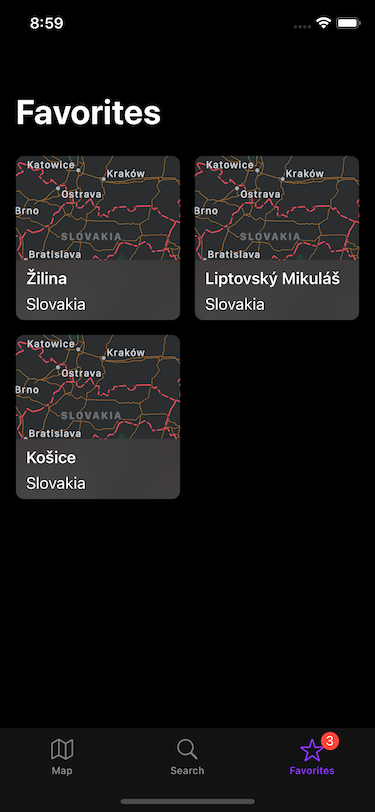
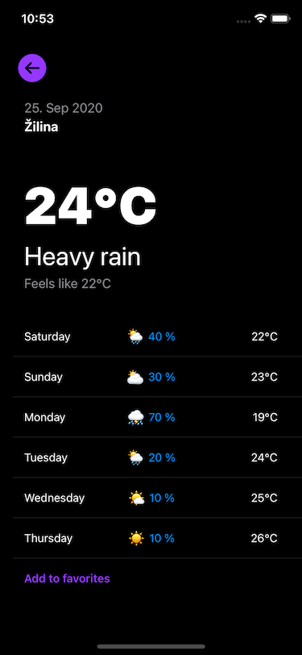
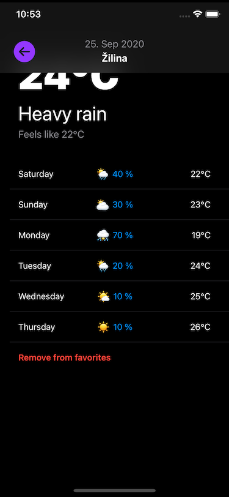

# ZADANIE #

Vytvor aplikáciu na predpoveď počasia, ktorá bude zobrazovať aktuálne počasie na zvolenom mieste. Aplikácia bude využívať voľne dostupné API. Z API získaj potrebné údaje a následne ich zobraz. Vzhľad a funkčnosť aplikácie je popísaná v nasledujúcej špecifikácii. 

## Technické požiadavky ##

### Programovanie ###

* dodržiavanie základných princípov OOP
* programovací jazyk Swift
* voľbu architektúry nechávame na teba
* kód musí byť skompilovateľný a bez warningov
* konzistentný a čitateľný kód
* odporúčame zvoliť si [style guide](https://www.google.com/search?q=swift+style+guide)

### Systém a zariadenia ###

* iOS 14 SDK
* podpora iOS 13 a vyššie
* všetky dostupné zariadenia iOS a iPadOS
* funkčné na simulátoroch aj reálnych zariadeniach

### Knižnice ###

* parsovanie API pomocou Codable
* používateľské rozhranie pomocou UIKit
* lokalizačné služby a (reverse)geocoding pomocou CoreLocation
* nepoužívaj žiadne externé knižnice mimo iOS SDK

### UI ###

* systémový font
* ikony použi natívne zo SF Symbols
* responzívne zobrazenie podporujúce všetky zariadenia
* lokalizácia aplikácie v slovenskom a anglickom jazyku

### API ###

* informácie o počasí získavaj z [OpenWeather](https://openweathermap.org/api)
* API kľúč si môžeš vygenerovať po registrácii

## Odovzdávanie ##

* vytvor private fork tohto repozitára
* prideľ admin práva na dominik.petho@goodrequest.com
* vytvor develop branchu
* zmeny môžeš commitovať a pushovať aj priebežne
* finálne zadanie odovzdaj ako pull request na master branchu
* ako reviewera nastav dominik.petho@goodrequest.com

## Špecifikácia ##

Základná navigácia aplikácie je riešená cez TabBar, ktorý rozdeľuje aplikáciu na 3 sekcie - Mapa, Vyhľadávanie a Obľúbené. Z každej sekcie sa dá otvoriť detail s počasím zvoleného mesta.

### Mapa ###

Mapa zobrazuje aktuálnu polohu zariadenia, ráta sa s ošetrením možných chybových stavov ako vypnuté lokalizačné služby alebo chýbajúce povolenie používateľa.

V spodnej časti je možnosť prepnúť zobrazenie mapy a vrátenie (nazoomovanie) na aktuálnu polohu.

Pri dlhom podržaní sa na mapu pridá pin so zvolenou lokalitou. Pin bude obsahovať názov mesta, v ktorom sa nachádza, získaný pomocou geocodingu. Po kliknutí na pin sa zobrazí deail s počasím pre dané mesto.

### Vyhľadávanie ###

 

Obrazovka umožňuje fulltextové vyhľadávanie lokality.

Po kliknutí na bunku sa zobrazí detail s počasím pre danú lokalitu.

### Obľúbené ###

Obrazovka zobrazuje zoznam lokalít, ktoré boli označené ako obĺúbené.

Zoznam obľúbených ostane uložený aj pri reštarte aplikácie.

Po kliknutí na bunku sa zobrazí detail s počasím pre danú lokalitu.

TabBar bude zobrazovať badge s počtom uložených lokalít.

### Detail ###

 

Obrazovka bude zobrazovať aktuálne počasie na zvolenej lokalite.

Obrazovka ďalej obsahuje predpoveď počasia na nasledujúce dni.

Lokalitu je možné pridať/odstrániť z obľúbených.

Ak sa detail nezmestí na obrazovku zariadenia, tak sa pri scrollovaní bude dynamicky zobrazovať horná navigácia. Samotný prechod zobrazovania/schovávania môžeš obohatiť o zaujímajú animáciu.

## Kritéria hodnotenia ##

Pri hodnotení sa budeme zameriavať na:

* kompletnosť riešenia v stanovenom čase,
* štruktúru projektu, logické rozdelenie do priečinkov,
* čitateľnosť kódu, dodržiavanie zvoleného code style,
* ošetrenie možných memory leakov a optional hodnôt,
* implementáciu zvolenej architektúry,
* univerzálnosť sieťovej časti, vyskladávanie requestov,
* parsovanie a mapovanie dát,
* použitie natívnych UI prvkov a constraintov,
* korektné zobrazenie na rôznych zariadeniach.
